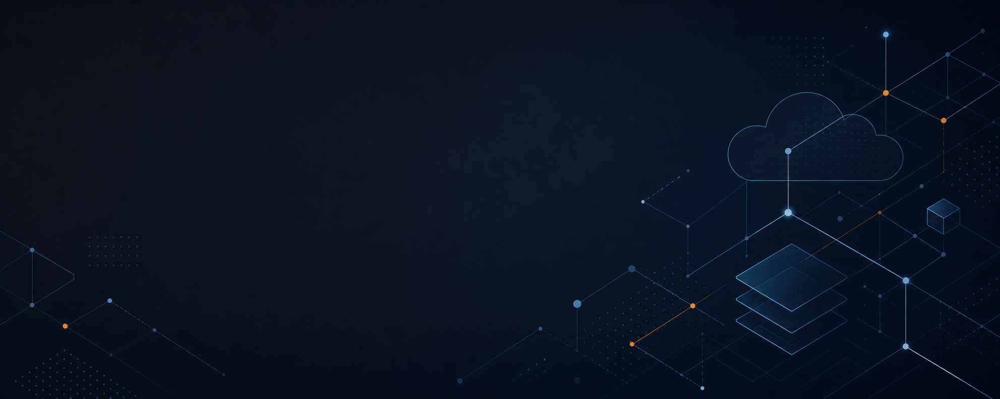

# Hola, soy Luis Fontecilla

**Network & Infrastructure Engineer | Cloud & DevOps | Linux | AWS | Terraform | Docker | Kubernetes | CCNA**  
Santiago, Chile

Profesional de TI especializado en redes, Linux e infraestructura, con más de nueve años de experiencia resolviendo incidentes, mejorando procesos de diagnóstico y apoyando la continuidad operacional. Actualmente amplío mi enfoque hacia DevOps, automatización y plataformas cloud.

*IT professional specializing in networking, Linux, and infrastructure, with over nine years of experience troubleshooting incidents, improving diagnostic processes, and supporting operational continuity. I am currently expanding my focus into DevOps, automation, and cloud platforms.*

## Áreas de especialidad / Areas of expertise

- **Networking:** operación, diagnóstico y resolución de incidentes; fundamentos CCNA y CCNP.
- **Systems:** administración y troubleshooting en Linux y VMware.
- **DevOps:** Docker, Kubernetes, GitHub Actions, Bash y Python.
- **Cloud:** fundamentos y servicios de AWS.
- **Security:** operación y diagnóstico de firewalls.

## Tecnologías / Technologies

## Certificaciones / Certifications

- Cisco Certified Network Associate — **CCNA**
- AWS Certified Cloud Practitioner

## En este momento / Currently

- Profundizando en automatización, contenedores y prácticas DevOps.
- Compartiendo proyectos y aprendizajes sobre redes, Linux y cloud.
- Abierto a conectar con profesionales y comunidades técnicas.

## Contacto / Contact

